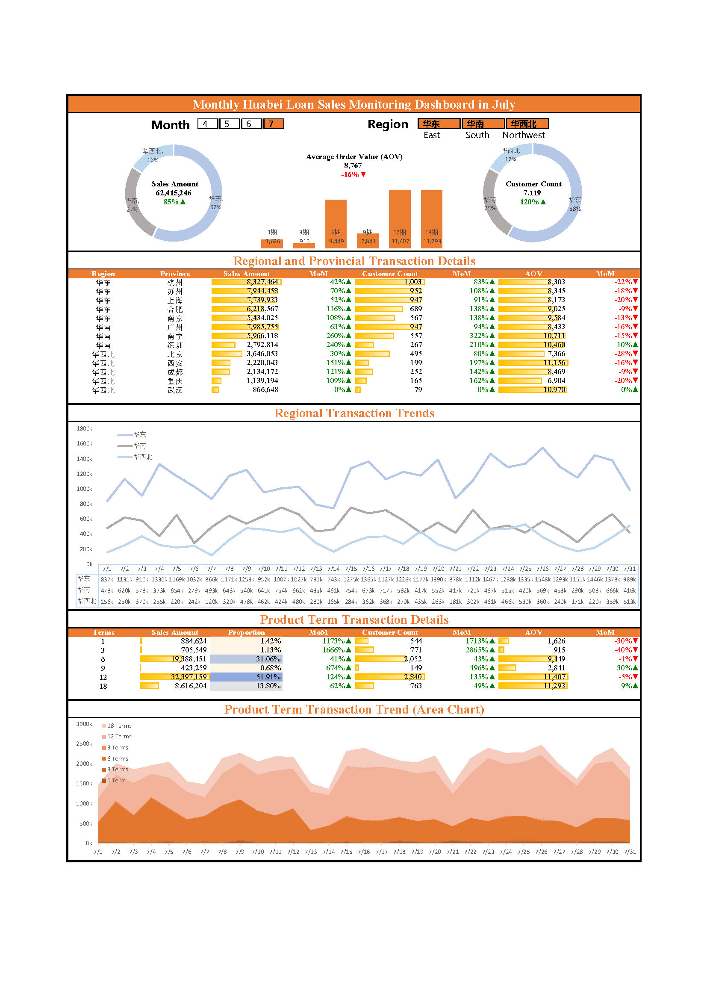

## 📊 Monthly Huabei Loan Sales Monitoring Dashboard

### Project Overview

This project leverages Excel's Power Query and Pivot Table features to build an interactive dashboard for monitoring Huabei loan product sales data in July, covering multiple analytical dimensions such as:

- Total transaction amount and count, with MoM and YoY changes
- Sales breakdown by region (East China, South China, Central China, North China) and province
- Product period breakdown (1/3/6/12/18-month installments)
- Trend analysis through line and area charts

### Technical Highlights

- 💡 Automated data cleaning with Power Query
- 📊 Multi-dimensional aggregation using Pivot Tables
- 📈 Trend and structure visualization using Excel Charts
- 🔍 Interactive analysis via slicers and dropdown filters

### File Structure

| Filename                | Description                                                  |
| ----------------------- | ------------------------------------------------------------ |
| `MonitoringDashboard_en.jpg`  | A snapshot of the dashboard for preview purposes             |
| `MonitoringDashboard_en.xlsx`  | The main Excel report with cleaned data, pivot tables, and visualization (English) |
| `月度销售数据监控.xlsx` | The main Excel report with cleaned data, pivot tables, and visualization (Chinese) |
| `6月_每日销售成交汇总数据.xlsx`| The source data of loan sales until June |
| `7月_每日销售成交汇总数据.xlsx`| The source data of loan sales in July |
| `销售人员表-截止8月1日.xlsx`| The related table about the employees |
|`历史数据.xlsx`| The cleaned data by using Power Query |


### Dashboard Preview




### How to Use

1. Clone this repo:

    ``` bash
    git clone [https://github.com/your-username/monthly-sales-monitoring-dashboard.git](https://github.com/EricZhongYJ/DataAnalysisLoanSalesExcel.git)
    ```

2. Open `月度销售数据监控.xlsx` in Excel

3. Use filters and slicers to switch months or regions

4. Explore sales breakdown and trend analysis

[转至中文README.md](README_cn.md)
