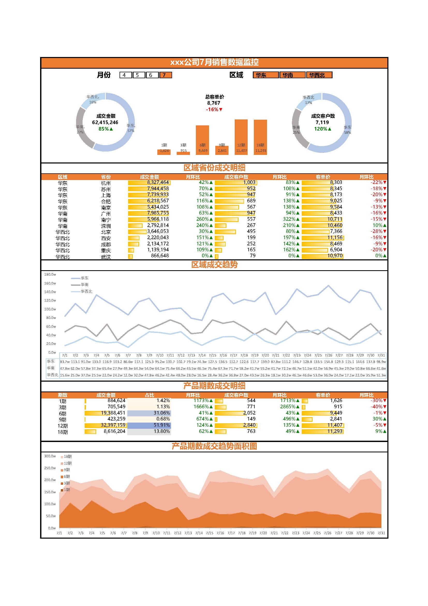

## 📊 月度花呗借贷销售数据监控报表

### 项目简介

本项目通过 Excel 的 Power Query 和数据透视表功能，完成了某公司 7 月份花呗借贷类产品的销售数据监控报表，涵盖多个维度的指标分析，包括：

- 成交金额与单数的同比与环比
- 按地区（华东、华南、华中、华北）及省份维度拆分销售数据
- 产品期数（1期/3期/6期/12期/18期）维度分析
- 销售趋势折线图与面积图可视化

### 技术亮点

- 💡 使用 Power Query 自动清洗原始销售数据
- 📈 通过 Excel 数据透视表进行多维度聚合
- 🎨 利用图表直观展示区域销售趋势与期数分布
- 🔄 支持月份筛选和区域交互分析（下拉菜单+切片器）

### 文件结构

| 文件名                  | 说明                                                 |
| ----------------------- | ---------------------------------------------------- |
| `MonitoringDashboard_cn.jpg`  | 报表截图，用于预览展示                               |
| `月度销售数据监控.xlsx` | 主报表文件，包含数据源、Power Query清洗过程、数据透视表分析结果及图表展示 |
| `6月_每日销售成交汇总数据.xlsx`| 6月花呗借贷销售源数据 |
| `7月_每日销售成交汇总数据.xlsx`| 7月花呗借贷销售源数据 |
| `销售人员表-截止8月1日.xlsx`| 销售人员关联表 |
|`历史数据.xlsx`| 清洗整合后的数据 |

### 截图预览



### 使用方法

1. 克隆本项目：

    ``` bash
    git clone https://github.com/EricZhongYJ/DataAnalysisLoanSalesExcel.git
    ```

2. 使用 Excel 打开 `月度销售数据监控.xlsx`

3. 可通过切换月份或区域按钮筛选对应数据

4. 查看趋势图与各维度拆解分析
